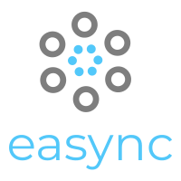

<p align="center"></p>

<p align="center">
  
<p>

#### A declarative approach to execute asynchronous tasks in javascript

With easync you can define from simple to complex flows that involve loops, conditions and more. You can arrange user interactions, asynchronous server calls, process data in different steps or whatever you want to organize in a declarative way.

## How it works?

Just follow 3 steps:

- Install easync with `npm i easync`

- Define your flow with inner tasks and conditions

```js
import easync, { Loop, Switch } from "easync";

const flow = () => {
  const asyncCondition = async () => {
    await sleep(1000);
    return true;
  };

  const condition = () => {
    return "Luke";
  };

  const asyncTask = async () => {
    await sleep(1000);
    return 1;
  };

  const task = () => {
    return 1;
  };

  return easync.create`
    <${Loop} while=${asyncCondition}>
      <${Switch} condition=${condition}>
        <${asyncTask} case="Ash" />
        <${task} case="Luke" />
      <//>
    <//>
  `;
};
```

For learning purposes we defined a flow with a Loop that iterates over a Switch that chooses the second Task. In this example we added an async function `sleep` before resolving the async task and the async condition to expose the asynchronous capabilities.

Now you can work with sync and async tasks and conditions!

- Start the flow!

```js
easync.start(flow);
```

If you want to learn more about all the things you can do with easync, check the [User Guide](./USER_GUIDE.md)

### Node usage

```js
const { easync, Loop, Switch } = require("easync");
```

You can use it in a Node server environment importing the library as you can see in the above example.

### License

easync is MIT licensed.
